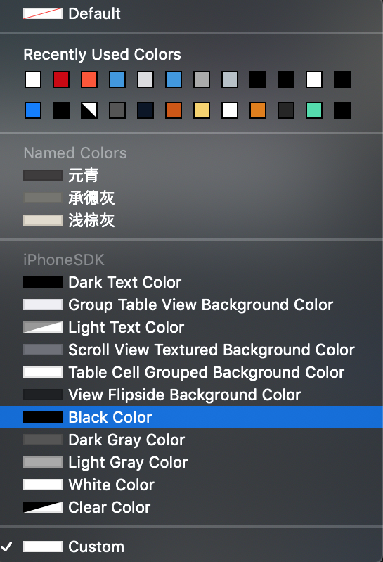
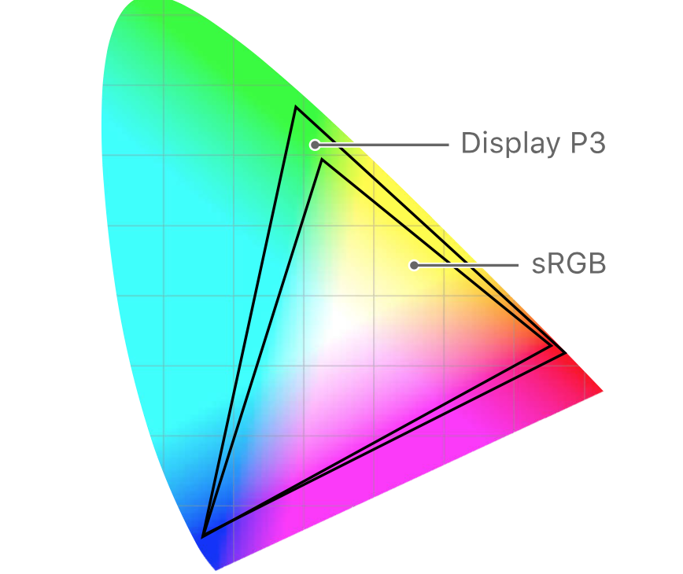
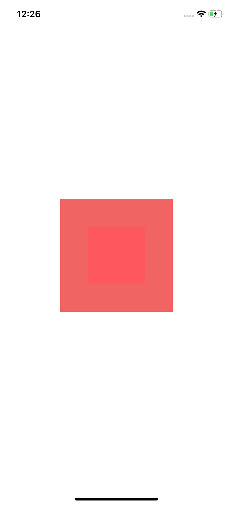
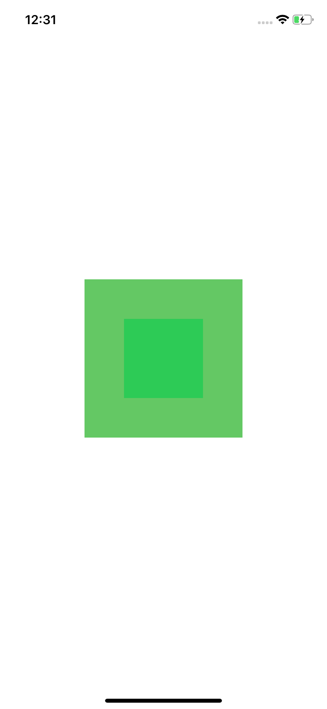
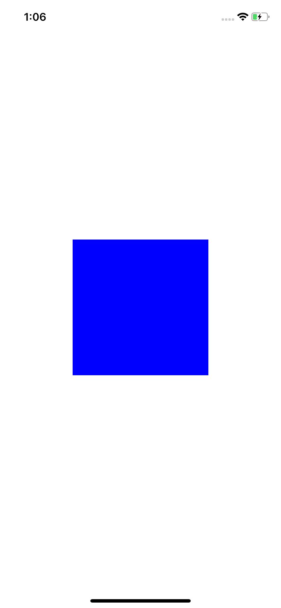

   

## 怎样给你的项目设置正确的颜色

为了表示颜色，需要两个组件：
1. 一个`表示颜色的值`
2. 一个`颜色空间`

首先关于这些值，有几种模型来描述它们：
1. RGBA（红色，绿色，蓝色，Alpha），这个也是我们在Xcode中主要使用的
2. HSV（色调，饱和度，值）
3. HSL（色调，饱和度，亮度）
4. 和更多…

然后就是`颜色空间`，它定义了可以通过上面提到的记号表示的颜色范围。

假设我们使用RGBA模型来声明一种颜色。使用这个模型，RGB通道中，每个通道的深度为8位，您最多可以表示255 x 255 x 255色=16581375（著名的1600万色），甚至更多，当您将它们与alpha分量（x 255再次组合）结合时，您将达到40多亿（也称为真彩色）。这是使用这个模型可以表示的颜色数量，注意这个值是固定的，并且和选择的一个颜色空间的大小无关：您不能使用RGBA模型中表示处超过该数量的颜色。假设这是一个固定数量的4228250625插槽，您想要表示的任何颜色都必须属于其中一个插槽。注意：使用更大的颜色空间不一定会获得更多的颜色，因为可以写下的颜色数量是有限制的。然而，改变的是，在处理较大的颜色空间时，两个连续值（例如：#A0A0A0和#A0A0A1）之间的变化对眼睛更为明显。这是因为当使用更大的颜色空间时，更多的实际颜色必须适合相同数量的固定插槽。此外，在较大的颜色空间中，极端值将代表更生动的颜色（例如，p3中的#FF0000比sRGB中的#FF0000更生动）。正是因为这些可观察到的变化，当你没有得到你想要的准确颜色时，你可能会头疼：也许你只是从一个颜色空间中获得他们的RGBA值，然后用不同的颜色空间在Xcode中生成它们。如果颜色空间不匹配，即使复制了相同的RGBA值，应用程序中的颜色也会不正确。

<table><tr>
    <td >
        

            颜色空间区别 
        

    </td>
    <td >
        

        1. RGB值同为#F06464
        

    </td>
    <td >
        

        2. RGB值同为#64C864
        

    </td>
    <td >
        

        3. RGB值同为#0000FF
        

    </td>
</tr></table>

## Entourage Color
> UIColor Extension 

Predefined Color and UIColor static function 

## Usage example

A few motivating and useful examples of how your product can be used. Spice this up with code blocks and potentially more screenshots.

_For more examples and usage, please refer to the [Wiki][wiki]._

## Release History
* 0.0.3
* Add more function
* 0.0.2
* Add README file
* 0.0.1
* First version

## Meta
Yuxuan Liu  – [@liuyuxuan1996](https://twitter.com/dbader_org) – freemanxliu@gmail.com

## Contributing

1. Fork it (<https://github.com/yourname/yourproject/fork>)
2. Create your feature branch (`git checkout -b feature/fooBar`)
3. Commit your changes (`git commit -am 'Add some fooBar'`)
4. Push to the branch (`git push origin feature/fooBar`)
5. Create a new Pull Request

<!-- Markdown link & img dfn's -->
[npm-image]: https://img.shields.io/npm/v/datadog-metrics.svg?style=flat-square
[npm-url]: https://npmjs.org/package/datadog-metrics
[npm-downloads]: https://img.shields.io/npm/dm/datadog-metrics.svg?style=flat-square
[travis-image]: https://img.shields.io/travis/dbader/node-datadog-metrics/master.svg?style=flat-square
[travis-url]: https://travis-ci.org/dbader/node-datadog-metrics
[wiki]: https://github.com/yourname/yourproject/wiki

